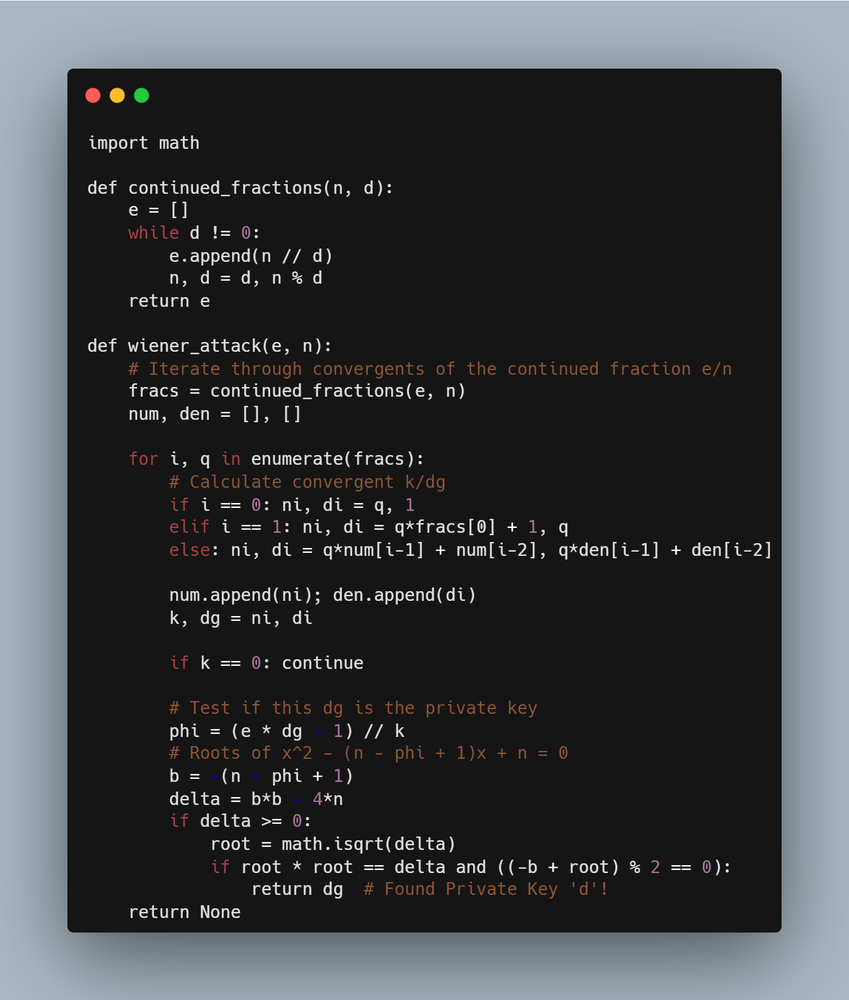
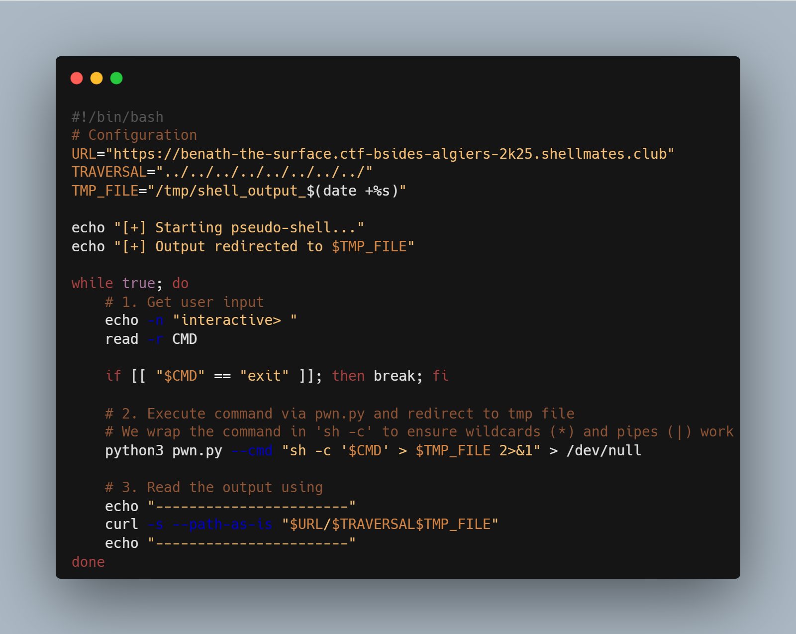

# Beneath The Surface- bsides algiers 2025

We started by discovering a **Local File Inclusion (LFI)** vulnerability, which allowed us to download the server binary (`chall`) and a core dump (`dump.bin`). Reverse engineering the binary showed that commands needed to be signed with a specific RSA key and sent to a hidden, randomly generated URL path. Analyzing `dump.bin` revealed a huge public exponent `e`, so we used **Wiener's Attack** to instantly recover the private key `d`, allowing us to sign our own commands. 

To find the hidden path, we leveraged the LFI again to perform a live memory leak. By reading `/proc/self/maps`, we located the process's Heap, and then used the server's `Offset` header to read that exact memory region via `/proc/self/mem`, revealing the secret 128-character execution path.

With the path and private key, we achieved **Blind RCE**, but seeing no output was frustrating. To solve this, I wrote a wrapper script (`shell.sh`) that redirects command output to a temp file (`cmd > /tmp/out`) and immediately reads it back using the LFI, effectively creating a fully interactive shell to capture the flag.

writeup by [shulkwi](https://github.com/shulkwisec/writeups/beneath-the-surface)