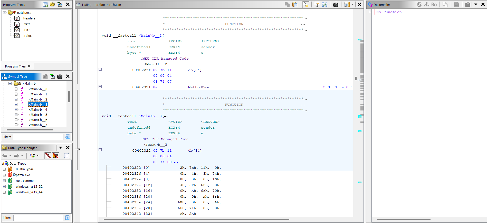
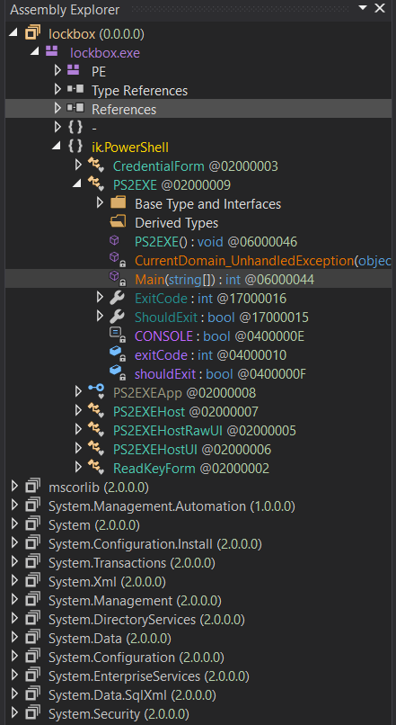

## wirtup – `lockbox.exe`
[📦 Download the Challenge (lockbox.7z)](lockbox.7z)

**Challenge:** Reverse the obfuscated `lockbox.exe` to find the flag.
**Hint:** *"How the lockbox was made is the key."*

---


I avoided running the binary. It looked shady and obfuscated — so I decided to solve it using **only static analysis** challngeing my self a bit `(also i dont have vm downloaded)`.


> Static analysis = thinking how a stone would reflect if hit a door

> Dynamic = actually throwing it


---

### 🔍 Progress: Ghidra... 🤷‍♂️.

I loaded it into **Ghidra** — hoping to find useful code or strings.

But nope:

* No readable strings
* Useless, junk functions
* Possibly encrypted or fake logic
* only thing valuable its .net string which mean 50% they used .net then to confirm you can use file



It felt intentionally messy. Then I remembered the hint:

> "*How it was made is the key.*"

Maybe this isn’t native code… maybe .NET?

---

### `dnSpy`  

I opened it with **dnSpy** (which is made for .NET apps).
Suddenly, everything made sense:

* Clean class names
* Organized structure
* A function called `PS2EXE`


---

### `PS2EXE`

I recognized `lockbox` contain interesting metohd called `PS2EXE` which contain a  **PowerShell scripts** inside `.exe` file.
So this binary was likely a **PowerShell payload** executer inside a .NET wrapper.

---

### `de Flag`

Inside the code was a **Base64 string**, decoded and used in the program.

Here's the key part (shortened):

```ps1
private static int Main(string[] args)
{
	PS2EXE ps2EXE = new PS2EXE();
	bool flag = false;
	string text = string.Empty;
.....
			string @string = Encoding.UTF8.GetString(Convert.FromBase64String("QWRkLVR5cGUgLUFzc2VtYmx5TmFtZSBNaWNyb3NvZnQuVmlzdWFsQmFzaWMNCiR3c2hlbGwgPSBOZXctT2JqZWN0IC1Db21PYmplY3QgV3NjcmlwdC5TaGVsbA0KJFBhc3MgPSBbTWljcm9zb2Z0LlZpc3VhbEJhc2ljLkludGVyYWN0aW9uXTo6SW5wdXRCb3goJ0VudGVyIHRoZSBwYXNzd29yZCB0byB1bmxvY2sgdGhlIGZsYWcnLCAnUGFzc3dvcmQnKQ0KaWYoJFBhc3MgLWVxICJXZWxjb21lVG9UaGVCbGFja0hpbGxzIikNCiAgICB7DQogICAgJHdzaGVsbC5Qb3B1cCgiZmxhZ3tyM3ZlcnMhbmdfMGJmdXNjYXQzZF9jMGRlXyFzX2Z1bn0iLDAsIkRvbmUiLDB4MSkNCiAgICB9DQplbHNlDQogICAgew0KICAgICR3c2hlbGwuUG9wdXAoIkluY29ycmVjdCBwYXNzd29yZCEgVHJ5IGFnYWluLiIsMCwiRG9uZSIsMHgxKQ0KICAgIH0="));
......
	if (flag)
	{
		Console.WriteLine("Hit any key to exit...");
		Console.ReadKey();
	}
	return ps2EXE.ExitCode;
}
....
```

I copied the Base64, decoded it manually…


`hhhhhhhh now we know what even the program will do 🤔`
---

```Later I confirmed: the structure exactly matched executables made by [`PS2EXE`](https://github.com/MScholtes/PS2EXE.git).```
---

*#shulkwisec*
